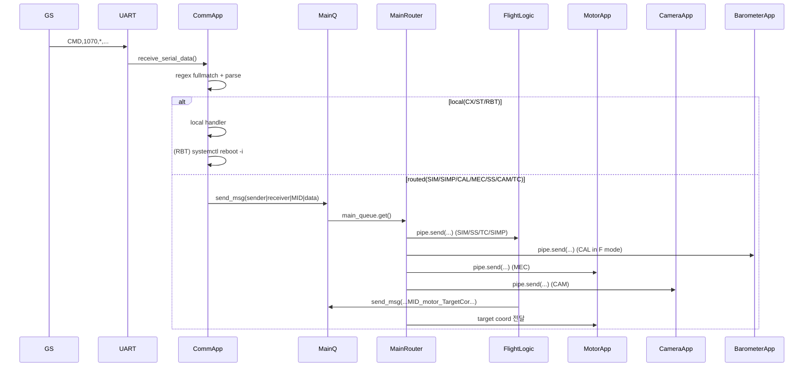
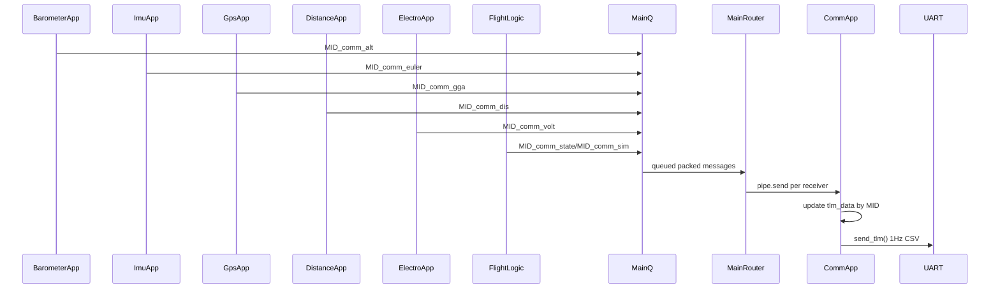

# CANSAT FSW 아키텍처 분석 보고서

## 0. 한 줄 요약
- 이 시스템은 `main.py`가 다수 앱 프로세스를 생성하고 `Queue + Pipe`로 라우팅하는 Python 멀티프로세스 FSW이다.
- nasa의 cfs Software Bus(cfe)와 app들 간의 관계를 추출해서 현재 fsw에 반영(https://github.com/nasa/cFS) sensor 연결없이 app들 간의 관계를 검증할 수 있도록 그리고 센서 연결 없이 최대한 많은 것들을 검증할 수 있도록 구현
- 앱간 MID 입력과 전달 과정을 기본과 중심심 틀로 잡기.

## 1. 전체 디렉토리/파일 구조

### 폴더별 역할
- **오케스트레이션/코어**
  - `main.py`: 전체 앱 프로세스 생성/시작, 메시지 라우팅, 종료/재시작 모니터링 (`runloop`, `process_monitor`, `restart_app`)
  - `lib/appargs.py`: AppID/MID 상수 정의
  - `lib/msgstructure.py`: `sender|receiver|MsgID|data` 생성/직렬화/역직렬화
  - `lib/events.py`: 멀티프로세스 로깅 큐 (`QueueListener/QueueHandler`)
        - 로그는 전체로그(print.csv), 각 앱별 로그(센서와 카메라 데이터 포함)
  - `lib/config.py`: 
        - GPIO 정의(5: release 솔레노이드, 6: egg 모터, 12, 13: 파라포일 조종 모터 left, right)
        - 센서 통신 속도 정의(I2c hz)
            bmp390: 10 
            bno085: 10(100hz로 읽고 평균내서 10번 -> 10hz)
            gnss 7 click: 10
            ina228: 1
            tf-luna: 10
            xbee: 10
            camera: 30fps

  - `lib/prevstate.py`: 상태/보정값//IMU yaw 오프셋/타깃좌표/카운터 영속화
        - 운용 모드(0: LAUNCH_PAD, 1: ASCENT, 2: APOGEE, 3: RELEASE, 4: EGG, 5: LANDED)
        - 상태 오버라이드: STATE를 상태로 강제 구동하는 기능이다. 고도로 STATE를 구별하고, 변환하는 기능을 끈다.
- **통신**
  - `comm/commapp.py`: UART 명령 수신, 정규식 명령 파싱/분기, TLM 집계/송신
  - `comm/uartserial.py`: `/dev/serial0` 기반 UART I/O
  - `comm/xbeereset.py`: pigpio18로 XBee reset 핀 펄스 기능 구현, main.py 시작 시 펄스 주기.
- **비행 로직**
  - `flight_logic/flightlogicapp.py`: state 정의, state 전이, 모터/카메라 명령 발행, 시뮬레이션 모드
    - state 정의 
        (0   LAUNCH_PAD   발사대 대기
        1   ASCENT   상승 중, 카메라 ON
        2   APOGEE   최고점 감지, 하강 대기
        3   RELEASE   파라포일 전개, 번와이어 점화, GNC 활성
        4   EGG   50m 이하, 팔 수납, 솔레노이드 사출 대기
        5   LANDED   착륙, 모터 OFF)
    - state 전이
        LAUNCH_PAD → ASCENT    : alt > 200m, cnt_ascent ≥ 3
        ASCENT     → APOGEE    : max_alt*0.8 < alt < max_alt-0.25, cnt_apogee ≥ 2
        ASCENT     → RELEASE   : alt ≤ max_alt*0.8, cnt_release ≥ 3  (APOGEE 건너뜀)
        APOGEE     → RELEASE   : alt ≤ max_alt*0.8, cnt_release ≥ 3
        RELEASE    → EGG       : alt ≤ 50m, cnt_release ≥ 3
        EGG        → LANDED    : alt ≤ 10m, cnt_landed ≥ 100 (약 100 barometer 틱)
    - 시뮬레이션 모드
        SIM ENABLE/ACTIVATE/DISABLE   시뮬레이션 모드 제어
        SIMP <압력값>   시뮬레이션 고도 입력
        SS <0~5>   강제 상태 전이
- **센서/액추에이터/카메라**
  - `Sensor_Barometer/`, `Sensor_Imu/`, `Sensor_Gps/`, `Sensor_Distance/`, `Sensor_Electro/`: 센서 읽기 + 메시지 송신 앱
  - `Sensor_Motor/motorapp.py`, `motor_control.py`, `motor_guidance.py`, `Motor_Egg.py`, `Motor_Release.py`: 패러포일/번와이어/솔레노이드 제어
  - `Sensor_Camera/cameraapp.py`, `picam.py`: 카메라 녹화 제어
  - 노이즈 제거 방안.
        - 이동평균필터 적용
- **운영 스크립트**
  - `startup.sh`, `cansat-fsw.service`, `setup_systemd_service.sh`

### 앱 실행 엔트리 정리
- **프로세스 엔트리**: `main.py`의 `*_launcher + Process(...)`
  - `barometerapp_main`, `gpsapp_main`, `imuapp_main`, `commapp_main`, `electroapp_main`, `flightlogicapp_main`, `motorapp_main`, `distanceapp_main`, `cameraapp_main`
- **스레드 실행**
  - `commapp.py`: `TlmSender_Thread`, `CmdReader_Thread`
  - `barometerapp.py`: reader/sender thread
  - `imuapp.py`: reader/sender thread
  - `gpsapp.py`: read/send thread
  - `distanceapp.py`: reader/sender thread
  - `electroapp.py`: reader/sender thread
  - `flightlogicapp.py`: state broadcast thread
  - `cameraapp.py`: recorder thread
  - `motorapp.py`: control thread

## 2. 시스템 계층 및 메시지 버스

### 계층 구조
1. 하드웨어 드라이버 계층: `Sensor_*/<sensor>.py`, `motor_control.py`, `picam.py`
2. 앱 계층: `*_app.py`가 센서/액추에이터 드라이버 호출
3. 버스/라우팅 계층: `lib/msgstructure.py`, `main.py(runloop)`
4. 외부 I/F 계층: `comm/commapp.py`(UART command/TLM)

### IPC 흐름 (Queue/Pipe)
- 앱 -> 메인 라우터: `msgstructure.send_msg(Main_Queue, ...)`로 Queue put
- 메인 라우터 -> 앱: `main.py`가 `main_queue.get()` 후 `receiver_app` 기준으로 해당 앱 `pipe.send(...)`
- 즉, 발신은 Queue 단일 채널, 수신은 앱별 Pipe fan-out 구조

### 메시지 포맷
- 생성: `fill_msg(sender, receiver, MsgID, data)`
- 직렬화: `pack_msg()` -> `"sender|receiver|MsgID|data"`
- 역직렬화: `unpack_msg()` -> 4필드 강제 검사
- `data`에 `|` 포함 금지 검증 존재

### AppID/MID 체계
- AppID는 `lib/appargs.py`에서 정수 할당 (Main=10, FlightLogic=11, Comm=12, ...)
- MID는 `MID_comm_*`, `MID_motor_*`, `MID_RouteCmd_*` 형태로 모듈 간 계약 역할

### 직접 호출 vs 메시지 경계
- 앱 간 연동은 대부분 `msgstructure.send_msg`로 분리됨
  - 예: FlightLogic->Motor, GPS->Motor, Barometer->Comm
- 각 앱 내부에서는 드라이버 직접 호출
  - 예: `barometer.read_barometer`, `picam.record`, `motor_control.control`

### 프로세스 모니터링/재시작
- 존재: `main.py`의 `process_monitor(3초 주기)`, `checkrunstatus`, `restart_app`
- 한계: `restart_app`가 모든 앱 런처를 `(main_queue, child_pipe, log_queue)` 시그니처로 재기동 시도하여, `cameraapp_launcher(pipe, log_queue)`, `motorapp_launcher(pipe, log_queue)`와 불일치 가능

## 3. Command 데이터 흐름 (단계별)

1) UART 수신  
- `comm/uartserial.py:receive_serial_data`가 `/dev/serial0`에서 line read

2) CommApp 명령 루프  
- `comm/commapp.py:read_cmd`에서 문자열 정리 (`strip`, `OK/빈줄` 무시)

3) 정규식 검증/파싱  
- `CX/ST/SIM/SIMP/CAL/MEC/SS/RBT/CAM/TC` 각각 `re.fullmatch` 검사

4) 명령 실행 분기  
- 로컬 처리 또는 메시지 라우팅 함수 호출 (`cmd_*`)

5) 라우팅  
- 라우팅형은 `msgstructure.send_msg`로 main queue 전달 -> `main.py`가 receiver_app Pipe로 전달

6) 대상 앱 핸들러 실행  
- 대상 앱의 `command_handler/dispatch`에서 MID별 실행

### 명령별 로컬 처리 vs 타 앱 라우팅
- **로컬 처리**
  - `CX`: 텔레메트리 송신 enable/disable (`TELEMETRY_ENABLE`)
  - `ST`: `set_timedelta`로 mission time 기준 변경
  - `RBT`: `os.system('systemctl reboot -i')` 즉시 실행
- **타 앱 라우팅**
  - `SIM` -> FlightLogic (`MID_RouteCmd_SIM`)
  - `SIMP` -> Comm 내 고도 계산 후 FlightLogic (`MID_RouteCmd_SIMP`)
  - `CAL` -> F모드: Barometer (`MID_RouteCmd_CAL`), S모드: FlightLogic resetmaxalt 메시지
  - `MEC` -> Motor (`MID_RouteCmd_MEC`)
  - `SS` -> FlightLogic (`MID_RouteCmd_SS`)
  - `CAM` -> Camera (`MID_RouteCmd_CAM`)
  - `TC` -> FlightLogic (`MID_RouteCmd_TC`) -> Motor 재전달 (`MID_motor_TargetCor`)

### 유효성 검증 실패 시 처리
- regex 불일치: `Invalid command` 로그 후 무시
- option 파싱 실패: 에러 로그
- 앱별 payload 파싱 실패(숫자 변환/필드 수 불일치): 에러 로그 후 return

### 보안/운용 리스크 (명령 측면)
- `RBT`는 인증/권한 검증 없이 수신 문자열만 맞으면 OS 재부팅 호출

## 4. Telemetry 데이터 흐름 (단계별)

1) 센서 샘플링  
- 각 Sensor App에서 하드웨어 읽기 스레드 실행

2) 앱 내부 데이터 유지  
- 전역/모듈 변수로 최신 샘플 보관

3) `MID_comm_*` 메시지 송신  
- Sensor App -> MainQueue -> MainRouter -> CommApp

4) CommApp 집계  
- `command_handler`에서 MID별 `tlm_data` 필드 업데이트

5) 패킷 직렬화  
- `send_tlm`에서 `$` 시작 CSV 문자열 생성

6) UART 송신  
- `uartserial.send_serial_data`로 1Hz 송신 (`TELEMETRY_ENABLE=True`일 때)

### 센서별 주기/집계 포인트
- Barometer: read 10Hz, FlightLogic/Motor 송신 10Hz, Comm 송신 1Hz
- IMU: read 10Hz, Motor 송신 10Hz, Comm 송신 1Hz
- GPS: read 10Hz(주석상 25->10 조정), Motor는 새 데이터 수신 시, Comm 1Hz
- Distance: read 10Hz, FlightLogic/Comm 송신 5Hz
- Electro: read 1Hz, Comm 송신 1Hz
- FlightLogic 상태 송신: 1Hz (`MID_comm_state`), SIM status는 이벤트성 송신

### tlm_data 필드 업데이트 매핑
- `MID_comm_alt` -> pressure/temperature/altitude
- `MID_comm_euler` -> filtered/acc/mag/gyro 각 축
- `MID_comm_gga` -> gps_time/alt/lat/lon/sats
- `MID_comm_volt` -> voltage/current/power
- `MID_comm_dis` -> distance
- `MID_comm_state` -> state
- `MID_comm_sim` -> mode

### 텔레메트리 패킷 포맷 점검
- 송신 포맷은 `$TEAMID,time,count,...,cmd_echo,,filtered_roll,filtered_pitch,filtered_yaw\n` 형태
- `cmd_echo` 뒤에 별도의 `","` 삽입 코드 존재
- `distance` 필드는 `tlm_data`에 저장되지만 실제 송신 CSV에는 포함되지 않음
- GPS lat/lon이 소수 둘째 자리로 포맷되어 위치 정밀도 손실 가능

## 5. 의존성 및 플랫폼 종속성

### 라이브러리 맵
- **I2C**
  - `board`, `busio`: barometer/imu/distance/electro 드라이버
  - `smbus2`: GPS I2C (`Sensor_Gps/gps.py`)
  - `adafruit_*`: BMP3XX, BNO08x 계열
  - 공통 I2C 경합 제어: `/tmp/i2c-1.lock + fcntl.flock` (`barometer.py`, `imu.py`, `gps.py`, `distance.py`, `electro.py`)
- **UART**
  - `pyserial`(동적 import `serial`) + `/dev/serial0` (`comm/uartserial.py`)
- **GPIO/PWM**
  - `pigpio`: XBee reset, 패러포일 서보
  - `RPi.GPIO`: burnwire/solenoid 릴레이 제어
- **카메라**
  - `picamera2 + H264Encoder (+FfmpegOutput)` (`Sensor_Camera/picam.py`)

### OS/하드웨어 종속성
- `systemctl reboot -i` (원격 RBT 명령)
- systemd 서비스 정의 (`cansat-fsw.service`)
- `startup.sh`에서 `sudo pigpiod`, venv activate, `python3 main.py`
- Linux 파일경로/디바이스 전제 (`/dev/serial0`, `/tmp/i2c-1.lock`)
- Raspberry Pi GPIO/카메라/I2C 스택 전제 코드 다수 존재
- README도 Raspberry Pi 환경(`/home/pi`, `picamera2`, `pigpiod`) 기준 설치 절차 명시

## 6. 주요 리스크/개선 포인트

- **[영향도: 상] 프로세스 재시작 인자 시그니처 불일치 가능**
  - 근거: `main.py`의 `restart_app`는 공통 `(main_queue, child_pipe, log_queue)`로 재시작, 반면 `cameraapp_launcher`, `motorapp_launcher`는 queue 인자 없음
  - 영향: 재시작 실패/반복 장애 가능
  - 개선 제안: AppID별 런처 인자 템플릿 분리

- **[영향도: 상] 원격 재부팅 명령 인증 부재**
  - 근거: `commapp.py:cmd_rbt`가 검증 없이 `systemctl reboot -i` 실행
  - 영향: 악성/오동작 명령으로 임무 중단
  - 개선 제안: 인증 토큰/시퀀스/화이트리스트 및 safe-state 게이트 추가

- **[영향도: 중] 텔레메트리 CSV 필드 불일치 가능**
  - 근거: `commapp.py:send_tlm`에서 `cmd_echo` 뒤에 추가 콤마 삽입 로직
  - 영향: 지상국 파서가 필드 오프셋 오인 가능
  - 개선 제안: 명세와 1:1 필드 매핑 테스트, 명시적 스키마 상수화

- **[영향도: 중] 수집한 거리 데이터가 TLM 패킷에 미포함**
  - 근거: `tlm_data.distance`는 업데이트되나 송신 CSV 빌드 목록에서 누락
  - 영향: 지상국에서 핵심 근접 정보 미관측
  - 개선 제안: 명세에 맞춰 필드 추가 또는 의도적 제외 문서화

- **[영향도: 중] GPS 좌표 송신 정밀도 저하**
  - 근거: `send_tlm`에서 `lat/lon :.2f`
  - 영향: 유도/분석용 위치 해상도 부족
  - 개선 제안: 최소 5~6자리 소수 송신

- **[영향도: 중] Queue 백프레셔 시 생산자 블로킹 가능**
  - 근거: `main_queue = Queue(maxsize=1000)`, `send_msg`는 block put
  - 영향: 고부하 시 앱 루프 지연/실시간성 저하
  - 개선 제안: non-blocking put + drop/priority 정책

- **[영향도: 중] systemd 경로와 startup 경로 불일치**
  - 근거: 서비스는 `/root/CANSAT...`, startup은 `/home/pi/CANSAT...`
  - 영향: 배포 환경에 따라 부팅 실패 가능
  - 개선 제안: 단일 환경변수/템플릿로 경로 통합

- **[영향도: 중] 다중 I2C 센서 동시 접근의 타이밍 민감성**
  - 근거: 공통 lock+timeout 사용, 여러 앱이 독립 스레드 주기로 I2C 접근
  - 영향: lock timeout/샘플 지연 발생
  - 개선 제안: 중앙 I2C broker 또는 주기 스케줄링 조정

- **[영향도: 하] `handle_barometer` 입력 파싱 형식 불일치 잠재**
  - 근거: Motor는 `MID_motor_alt`에서 단일 float를 받는데 split 기반 구현
  - 영향: 현재 동작은 되나 포맷 변경 시 취약
  - 개선 제안: 입력 계약 고정(단일 값 파싱으로 단순화)

- **[영향도: 하] README 상태명 예시와 실제 상태 enum 불일치**
  - 근거: README 예시 상태명과 `flightlogicapp.py` 상태명이 다름
  - 영향: 운용자 오입력/시험 혼선
  - 개선 제안: 문서와 코드 상태명 동기화

## 7. 근거 파일 인덱스
- `main.py`: `runloop`, `process_monitor`, `checkrunstatus`, `restart_app`, `terminate_FSW`
- `lib/appargs.py`: `MainAppArg`, `CommAppArg`, `FlightlogicAppArg`, 각 `MID_*`
- `lib/msgstructure.py`: `fill_msg`, `pack_msg`, `unpack_msg`, `send_msg`
- `lib/events.py`: `init_events_main_process`, `init_events_subprocess`, `LogEvent`
- `lib/config.py`: `FSW_CONF`, `STATE_OVERRIDE`, `YAW_OFFSET`
- `lib/prevstate.py`: `init_prevstate`, `update_prevstate`, `update_target_gps`, `update_packet_count`
- `comm/commapp.py`: `read_cmd`, `cmd_*`, `send_tlm`, `command_handler`, `commapp_main`
- `comm/uartserial.py`: `init_serial`, `send_serial_data`, `receive_serial_data`
- `comm/xbeereset.py`: `send_reset_pulse`
- `flight_logic/flightlogicapp.py`: `dispatch`, `barometer_logic`, `handle_target_coord`, `to_*`, `flightlogicapp_main`
- `Sensor_Barometer/barometerapp.py`: `read_barometer_data`, `send_barometer_data`, `command_handler`
- `Sensor_Imu/imuapp.py`: `read_imu_data`, `send_imu_data`, `imuapp_main`
- `Sensor_Gps/gpsapp.py`: `read_and_send_gps_data`, `gpsapp_main`
- `Sensor_Distance/distanceapp.py`: `read_distance_data`, `send_distance_data`
- `Sensor_Electro/electroapp.py`: `read_electro_data`, `send_electro_data`
- `Sensor_Motor/motorapp.py`: `dispatch`, `handle_*`, `_check_fdir`, `ctrl_paragldr`, `motorapp_main`
- `Sensor_Motor/motor_control.py`: `init_control`, `control`, `set_neutral`, `set_motors_off`
- `Sensor_Motor/motor_guidance.py`: `guidance`, `is_gps_valid`, `is_gps_jump`, `_outer_loop`
- `Sensor_Motor/Motor_Egg.py`: `init_solenoid`, `activate_solenoid`
- `Sensor_Motor/Motor_Release.py`: `init_burnwire`, `activate_burnwire`
- `Sensor_Camera/cameraapp.py`: `command_handler`, `picam_record_thread`, `cameraapp_main`
- `Sensor_Camera/picam.py`: `init_cam`, `record`, `terminate`
- `startup.sh`: pigpiod 시작, venv 활성화, `python3 main.py` 실행
- `cansat-fsw.service`: systemd 실행 단위/재시작 정책
- `README.md`: 설치/환경 전제(Raspberry Pi, picamera2, pigpiod)

## 확정 사실
- 메시지 버스는 Queue(상향) + Pipe(하향) 조합이며 메시지 포맷은 `sender|receiver|MsgID|data`입니다.
- Command 파싱은 `commapp.py:read_cmd`의 정규식 기반 분기이며, `CX/ST/RBT`는 로컬 처리, 나머지는 라우팅 중심입니다.
- Telemetry는 CommApp이 앱별 `MID_comm_*` 데이터를 `tlm_data`로 집계해 1Hz UART 송신합니다.
- I2C 충돌 완화를 위해 여러 센서 드라이버가 `/tmp/i2c-1.lock + fcntl.flock`을 사용합니다.
- cFS 관련 문자열/연동 코드는 저장소 검색 기준 확인되지 않았습니다.

# 고려해야할 점.
tlm에 distance print 추가.